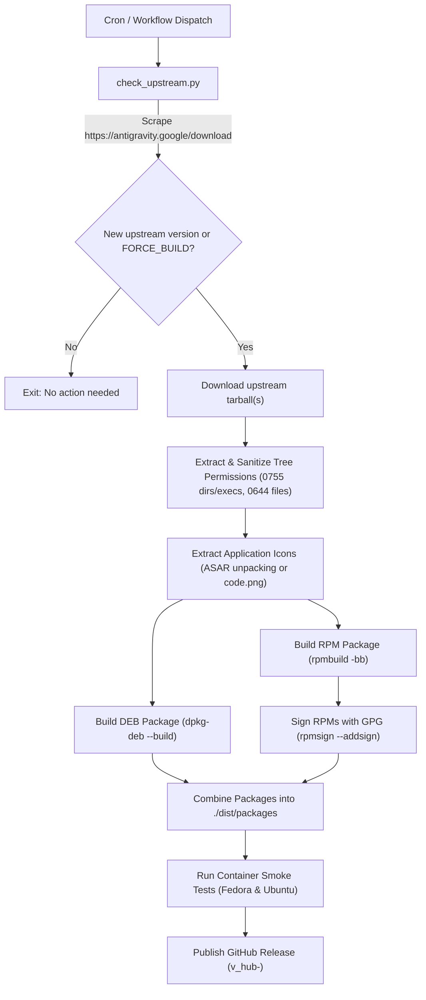
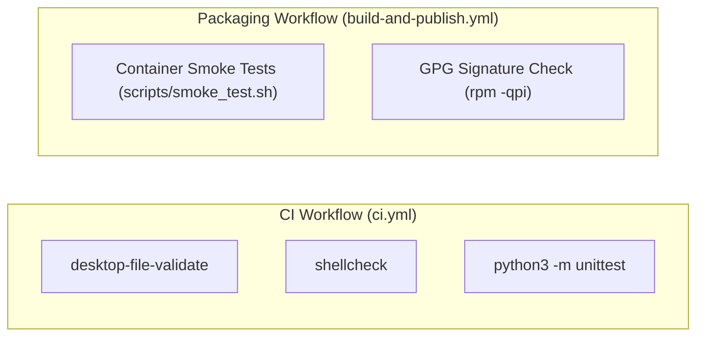

# Agent Development & Architecture Guide (`AGENTS.md`)

This document provides a comprehensive technical overview and operational guide for AI agents and maintainers working within the **`antigravity-packages`** repository.

---

## 1. Repository Purpose & Architecture

The **`antigravity-packages`** repository provides automated community packaging and distribution infrastructure for Google Antigravity on Linux. Google publishes standalone Linux tarballs without official package manager repositories; this project bridges that gap by providing native **RPM** (DNF/YUM) and **DEB** (APT) repositories with daily upstream synchronization.

### Applications Managed
1. **`antigravity-ide`** — Google's official AI-first desktop code editor (based on Code OSS). Packaged natively as RPM and DEB, installed into `/usr/share/antigravity-ide`, symlinked to `/usr/bin/antigravity-ide`, with `antigravity-ide://` OAuth URL handling and FreeDesktop desktop menu entries.
2. **`antigravity`** — Google's official agent platform and hub (Antigravity 2.0). Packaged natively as RPM and DEB, installed into `/usr/share/antigravity`, symlinked to `/usr/bin/antigravity`, with `antigravity://` OAuth URL handling and FreeDesktop desktop menu entries.
3. **`agy` (Antigravity CLI)** — Google's official terminal agent. Seamlessly orchestrated via `install.sh` into `$HOME/.local/bin/agy` (user-space). Preserves Google's native background self-updating (every 15 min), requires zero root privileges for CLI-only installs, avoids filename collisions with `/usr/bin/antigravity` (Hub), and completely prevents `$PATH` shadowing conflicts with Google's canonical installer.

### Supported Architectures
- **`x86_64`** (`amd64` in Debian nomenclature)
- **`aarch64`** (`arm64` in Debian nomenclature)

---

## 2. Repository Layout & File Mapping

```
antigravity-packages/
├── .github/
│   └── workflows/
│       ├── build-and-publish.yml  # Daily cron & manual workflow: checks upstream, builds packages, runs smoke tests, publishes release, generates repos, deploys Pages
│       ├── deploy-pages.yml       # Triggers on changes to landing page templates, assets, or scripts to update GitHub Pages without rebuilding binaries
│       └── ci.yml                 # PR & push quality gate: validates desktop files, shell scripts (ShellCheck), and executes unit tests
├── assets/                        # Public images, logos, and high-resolution application icons
│   ├── antigravity.png            # Hub icon
│   ├── favicon.png                # Web browser tab icon for the landing page
│   ├── hub-logo.png / .webp       # Antigravity Hub visual branding assets
│   ├── icon.png                   # Fallback square icon
│   └── logo.png / .webp           # Antigravity IDE visual branding assets
├── desktop/                       # FreeDesktop application desktop entry templates & context menus
│   ├── antigravity.desktop        # Desktop entry for Antigravity Hub (Categories, Keywords, URL scheme: antigravity://)
│   ├── antigravity-ide.desktop    # Desktop entry for Antigravity IDE (Categories, Keywords, MIME types, %F)
│   ├── antigravity-ide-url-handler.desktop # Hidden protocol handler for antigravity-ide:// URLs (NoDisplay=true)
│   ├── dolphin/                   # KDE Dolphin context menu (KIO Service Menu)
│   ├── nautilus/                  # GNOME Files & Caja right-click Python extension
│   └── nemo/                      # Linux Mint / Cinnamon right-click Nemo Action
├── scripts/                       # Core Python & Bash build, automation, and diagnostic scripts
│   ├── build_packages.py          # Downloads upstream tarballs, normalizes permissions, extracts icons, and builds .rpm & .deb packages
│   ├── check_upstream.py          # Scrapes Google's download page for new releases, compares against latest GitHub Release, and sets CI outputs
│   ├── generate_repos.sh          # Generates RPM (createrepo_c) and APT (dpkg-scanpackages) repository metadata, signs releases, prepares Pages dist/
│   ├── inject_versions.py         # Injects release versions from GitHub release tags into HTML landing pages during repo generation
│   ├── smoke_test.sh              # Containerized end-to-end installation test for Fedora and Ubuntu (Docker / Podman)
│   └── stats.py                   # CLI analytics tool querying GitHub Releases API to track package downloads across arch and formats
├── site/                          # Astro + Tailwind CSS web frontend (managed with Bun)
│   ├── astro.config.mjs           # Astro configuration (base /antigravity-packages, static file format)
│   ├── package.json               # Dependencies (Astro, Tailwind v4, TypeScript)
│   └── src/
│       ├── components/            # Reusable UI components (Navbar, Footer, TerminalHero, Features, Faq)
│       ├── data/siteConfig.ts     # Single source of truth (release versions, commands, GPG keys, FAQs)
│       ├── layouts/BaseLayout.astro # Common SEO, OpenGraph, JSON-LD schema, and analytics layout
│       ├── pages/                 # Static pages (index.astro, docs.astro)
│       └── styles/global.css      # Tailwind v4 theme styling and terminal CSS
├── templates/                     # Pre-rendered HTML templates for fallback and test backwards compatibility
├── tests/
│   └── test_packaging.py          # Python unit test suite (version parsing, upstream regex matching, stats processing, desktop entries, templates)
├── AGENTS.md                      # This technical guide for AI agents and maintainers
├── antigravity.gpg                # Binary GPG public keyring for APT (/etc/apt/keyrings/antigravity.gpg)
├── google676aa476e852c7b0.html    # Google Search Console domain ownership verification
├── install.sh                     # Universal one-line shell installer script for client systems
├── mise.toml                      # Mise tool environment definition (Python, gh, bun, node)
├── README.md                      # User-facing documentation and installation guide
└── RPM-GPG-KEY-antigravity        # ASCII-armored GPG public key for RPM (DNF/YUM) and APT (.asc)
```

---

## 3. How Packages Get Built

The build workflow is driven by `scripts/check_upstream.py`, `scripts/build_packages.py`, and the GitHub Actions workflow `.github/workflows/build-and-publish.yml`.

### High-Level Build Pipeline



### 3.1 Upstream Release Detection (`scripts/check_upstream.py`)
- **Scrapes**: `https://antigravity.google/download` with a browser User-Agent.
- **Regex Patterns**:
  - **Antigravity Hub**: `https://storage.googleapis.com/antigravity-public/antigravity-hub/([0-9a-zA-Z\.\-]+)/linux-(x64|arm)/Antigravity\.tar\.gz`
  - **Antigravity IDE**: `https://edgedl.me.gvt1.com/edgedl/release2/[^\"\' ]+/([0-9a-zA-Z\.\-]+)/linux-(x64|arm)/Antigravity(?:%20|\+)IDE\.tar\.gz`
- **Version Format**: Upstream versions follow `<semver>-<build_number>` (e.g. `2.5.5-4923483625488384` for IDE or `2.18.1-4945794252537856` for Hub).
- **Delta Optimization**:
  - The script checks assets attached to the latest GitHub Release (`gh release view --json tagName,assets`).
  - Sets output variables `ide_needs_build` and `hub_needs_build`.
  - If only one application was updated upstream, the CI workflow downloads the pre-built packages for the unchanged application from the previous release tag (`gh release download "$prev_tag"`), saving build time and avoiding redundant packaging.
- **Target Release Tag**: Format `v{ide_version}_hub-{hub_version}`, ensuring unique release tags whenever either app updates.
- **Manual Overrides**: Supports `FORCE_BUILD=true`, `FORCE_IDE=true`, and `FORCE_HUB=true` via workflow dispatch inputs or environment variables.

### 3.2 Packaging Pipeline (`scripts/build_packages.py`)

Executed separately for each package and architecture:
```bash
python3 scripts/build_packages.py \
  --package <antigravity|antigravity-ide> \
  --version-full "<version-full>" \
  --url "<download-url>" \
  --arch <x86_64|aarch64> \
  --output-dir ./dist/packages
```

#### Steps Executed:
1. **Version Splitting (`split_version`)**:
   - `2.5.5-4923483625488384` is split into Version: `2.5.5` and Release: `4923483625488384`.
2. **Extraction & Sanitization**:
   - Tarball extracted into an isolated `/tmp/` work folder.
   - Google tarballs often extract into directory names with spaces (e.g., `Antigravity IDE/`). The script renames the directory to `app_source/` to eliminate path issues.
   - `sanitize_tree_permissions` traverses the directory tree:
     - All directories: `0755`
     - Executables (ELF headers `\x7fELF`, shebangs `#!`, `bin/` directories, `language_server`, `rg`): `0755`
     - Chromium SUID Sandbox (`chrome-sandbox`): `4755 root:root` (enforced via RPM `%install` / `%post` and DEB staging / `postinst` to ensure process isolation on Ubuntu 24.04+, Debian, and hardened kernels)
     - Regular data files: `0644`
3. **Icon Resolution**:
   - **Antigravity IDE**: Extracts icon from `resources/app/resources/linux/code.png`.
   - **Antigravity Hub**: Electron application with assets inside `resources/app.asar`. `extract_asar_file()` parses the ASAR binary header table to extract `icon.png` without requiring Node.js or `asar` npm packages.
   - **Fallback**: Uses `assets/icon.png` if dynamic extraction fails.
4. **RPM Generation (`build_rpm`)**:
   - Creates RPM build tree: `BUILD`, `RPMS`, `SOURCES`, `SPECS`, `SRPMS`.
   - Generates `.spec` file:
     - Sets `AutoReqProv: no` to avoid pulling unnecessary internal Electron bundled shared libraries.
     - Declares explicit system dependencies: `gtk3, libnotify, nss, alsa-lib, libXScrnSaver`.
     - Places application files in `/usr/share/<package_name>/`.
     - Creates symlink `/usr/bin/<package_name>`.
     - Installs desktop entry in `/usr/share/applications/<package_name>.desktop`.
     - Installs 512x512 icons in `/usr/share/icons/hicolor/512x512/apps/<package_name>.png` and `/usr/share/pixmaps/<package_name>.png`.
     - Includes `%post` and `%postun` triggers for `update-desktop-database` and `gtk-update-icon-cache`.
   - Invokes `rpmbuild -bb --target <rpm_arch> <spec_file>`.
5. **DEB Generation (`build_deb`)**:
   - Creates Debian staging directory structure: `usr/share/<package_name>`, `usr/bin`, `usr/share/applications`, `usr/share/icons`, `usr/share/pixmaps`, `DEBIAN`.
   - Generates `DEBIAN/control` with package metadata, version (`<ver>-<rel>`), architecture (`amd64` or `arm64`), and system dependencies (`libgtk-3-0, libnotify4, libnss3, libxss1, libasound2`).
   - Generates executable `postinst` and `postrm` scripts that update desktop database and GTK icon cache if present.
   - Invokes `dpkg-deb --build --root-owner-group <stage_dir> <output_deb>`.

### 3.3 Package Signing
- **RPM Signing**: In CI, private key `GPG_PRIVATE_KEY` is imported, and RPMs are signed using `rpmsign --addsign ./dist/packages/*.rpm` configured with `~/.rpmmacros`. A verification check runs `rpm -qpi` to guarantee that no unsigned package is released.
- **DEB Signing**: The APT `Release` index is signed during repository generation (see Section 4).
- **GPG Identity**:
  - Key ID: `7A48CA4D7E7B6601`
  - Fingerprint: `E83A 23BC 57FE 6953 E4B5  F465 7A48 CA4D 7E7B 6601`
  - Maintainer: `X3M Antigravity Packagers <packaging@x3m.industries>`

---

## 4. How GitHub Pages & Repositories Are Built

GitHub Pages serves both the **user-facing landing page** and the **package manager repository metadata** for DNF and APT.

### 4.1 Repository Structure in `./dist`

The script `scripts/generate_repos.sh <RELEASE_TAG> <DIST_DIR>` builds the deployment bundle:

```
./dist/
├── index.html                   # Landing page copied from templates/index.html
├── install.sh                   # Universal curl installer script
├── RPM-GPG-KEY-antigravity       # ASCII armored GPG key
├── antigravity.gpg              # Binary GPG keyring
├── favicon.png                  # Site favicon
├── assets/                      # Logos, icons, webp images
├── google*.html                 # Search Console verification
├── robots.txt                   # Search crawler directives
├── sitemap.xml                  # Dynamic sitemap with current UTC timestamp
├── rpm/
│   ├── repodata/                # Generated by createrepo_c
│   │   ├── repomd.xml
│   │   ├── <hash>-primary.xml.gz
│   │   └── ...
│   ├── antigravity.repo         # Client repo configuration for /etc/yum.repos.d/
│   └── RPM-GPG-KEY-antigravity
└── deb/
    ├── pool/
    │   └── main/                # DEB packages during generation
    ├── dists/
    │   └── stable/
    │       ├── Release          # APT Release file
    │       ├── Release.gpg      # Detached GPG signature
    │       ├── InRelease        # Clearsigned inline GPG release
    │       └── main/
    │           ├── binary-amd64/
    │           │   ├── Packages
    │           │   └── Packages.gz
    │           └── binary-arm64/
    │               ├── Packages
    │               └── Packages.gz
    ├── antigravity.sources      # Modern DEB822 repository file for /etc/apt/sources.list.d/
    ├── antigravity.list         # Traditional APT list file
    ├── antigravity.gpg          # Binary GPG keyring
    └── antigravity.asc          # ASCII armored public key
```

### 4.2 RPM Repository Generation (DNF/YUM)
- **`createrepo_c` with External URLs**:
  ```bash
  createrepo_c -u "https://github.com/x3m-industries/antigravity-packages/releases/download/${RELEASE_TAG}/" "${RPM_DIR}"
  ```
  The `-u` parameter directs DNF/RPM to download the `.rpm` binaries directly from GitHub Releases CDN. This is critical because **GitHub Pages has strict storage and bandwidth limits** and GitHub Releases provides high-speed CDN delivery for large (>100MB) binary packages.
- **Client Configuration**: `dist/rpm/antigravity.repo` points to `baseurl=https://x3m-industries.github.io/antigravity-packages/rpm/` with `gpgcheck=1`.

### 4.3 DEB Repository Generation (APT)
- **Package Scanning**: `dpkg-scanpackages --arch <arch> --multiversion pool/main` generates `Packages` and `Packages.gz` for `amd64` and `arm64`.
- **Release Index**: Creates `dists/stable/Release` declaring Origin, Suite, Codename, Architectures, and Date.
- **Cryptographic Signing**:
  - `Release.gpg`: Detached signature created with `gpg --detach-sign`.
  - `InRelease`: Inline clearsigned release created with `gpg --clearsign`.
- **Client Configurations**:
  - `antigravity.sources`: Modern DEB822 format referencing `Signed-By: /etc/apt/keyrings/antigravity.gpg`.
  - `antigravity.list`: Traditional one-line format.

### 4.4 Size Optimization Before Deployment
Before publishing to GitHub Pages via `actions/upload-pages-artifact@v5`:
```bash
rm -rf ./dist/packages
rm -f ./dist/rpm/*.rpm
```
**All heavy binary packages are purged from `dist/`**. Only the lightweight repository metadata index files (`repodata/`, `Packages.gz`, `Release`), HTML landing page, scripts, and static assets are uploaded to Pages.

### 4.5 GitHub Pages Workflows
1. **`build-and-publish.yml`**: Runs nightly or on demand; updates metadata after publishing a new binary release.
2. **`deploy-pages.yml`**: Triggers on `push` to `main` whenever landing page templates, assets, or scripts change, downloading existing release packages to rebuild and deploy updated repository metadata without needing a new binary release.

---

## 5. How Validation Works

Quality assurance consists of three layers: **Static Analysis / Linting**, **Unit Tests**, and **Container Smoke Tests**.



### 5.1 Static Analysis & Linting (in `ci.yml`)
1. **Desktop Entry Validation**:
   ```bash
   desktop-file-validate desktop/*.desktop
   ```
   Validates compliance with FreeDesktop desktop entry specifications (valid categories, action keys, URL handlers, syntax).
2. **Bash Script Linting**:
   ```bash
   shellcheck --severity=warning scripts/generate_repos.sh scripts/smoke_test.sh install.sh
   ```
   Ensures POSIX / bash compliance, safe quoting, correct error trapping, and zero syntax errors.

### 5.2 Unit Test Suite (`tests/test_packaging.py`)
Run locally or in CI:
```bash
python3 -m unittest discover tests -v
```

The test suite covers:
- **`test_split_version`**: Tests version/release splitting for standard Google build numbers (`2.5.5-4923483625488384`), semver (`2.18.1`), and complex pre-release tags.
- **`test_upstream_regex_matching`**: Tests Google download page HTML scraping regexes against real HTML markup for both Hub and IDE, on both x64 and arm.
- **`test_analyze_downloads`**: Tests `scripts/stats.py` metrics aggregation (by package, format, architecture, asset size).
- **`test_desktop_files`**: Validates required sections (`[Desktop Entry]`), keys (`Exec`, `Icon`, `Type`), and invokes `desktop-file-validate` if installed.
- **`test_installer_script`**: Validates `install.sh` integrity, error handling, function names, and repo URLs.
- **`test_html_template`**: Validates `templates/index.html` structure, client-side tabs, OS detection, GPG keys, and author branding.

### 5.3 Container Package Smoke Tests (`scripts/smoke_test.sh`)
Runs inside `.github/workflows/build-and-publish.yml` immediately after packages are built and signed:
- **Fedora Container (`docker.io/library/fedora:latest`)**:
  - Mounts `./dist/packages` read-only.
  - Installs RPMs using `dnf install -y /packages/*x86_64.rpm`.
  - Verifies package database: `rpm -q antigravity`, `rpm -q antigravity-ide`.
  - Verifies `/usr/bin/antigravity` and `/usr/bin/antigravity-ide` binaries are executable symlinks.
  - Verifies `/usr/share/applications/*.desktop` integration.
- **Ubuntu Container (`docker.io/library/ubuntu:24.04`)**:
  - Mounts `./dist/packages` read-only.
  - Updates apt and installs DEBs using `apt-get install -y /packages/*amd64.deb`.
  - Verifies package database: `dpkg -s antigravity`, `dpkg -s antigravity-ide`.
  - Verifies binary execution and desktop entries.
- **Fallback**: If no container engine (Docker or Podman) is available, it performs structural header inspection using `rpm -qpi` and `dpkg-deb -I`.

---

## 6. Download Statistics & Analytics (`scripts/stats.py`)

The repository includes a dedicated CLI analytics tool to inspect download metrics:
```bash
# Pretty dashboard output
./scripts/stats.py

# Raw JSON output for automation
./scripts/stats.py --json
```

- Queries the GitHub Releases API (`https://api.github.com/repos/x3m-industries/antigravity-packages/releases`).
- Optional authentication: set `GH_TOKEN` or `GITHUB_TOKEN` to prevent rate limits.
- Breaks down downloads across:
  - **Package**: `antigravity-ide` vs `antigravity`
  - **Architecture**: `x86_64` vs `aarch64`
  - **Format**: `rpm` vs `deb`
  - Detailed asset table showing size and download count per release.

---

## 7. Guidelines for Agents Working in this Repository

### 7.1 Local Verification Commands
Before submitting any changes, always run the validation suite:

```bash
# 1. Run unit tests
python3 -m unittest discover tests -v

# 2. Validate Astro site type safety and static build
cd site && bun run check && bun run build && cd ..

# 3. Run ShellCheck on scripts (if shellcheck is available)
shellcheck --severity=warning scripts/generate_repos.sh scripts/smoke_test.sh install.sh

# 4. Validate desktop entries (if desktop-file-utils is available)
desktop-file-validate desktop/*.desktop

# 5. Test upstream detection logic (safe read-only HTTP request)
python3 scripts/check_upstream.py
```

### 7.2 Safety & Best Practices for Agents
1. **Never Commit Large Binaries**: Never commit `.rpm`, `.deb`, `.tar.gz`, or `./dist` build artifacts to git. The `.gitignore` is configured to ignore `dist/`, `tmp/`, `site/dist/`, `site/node_modules/`, and package files. Releases host the binaries.
2. **Preserve Path Sanitization**: Google's upstream IDE tarballs expand to folders containing spaces (e.g. `Antigravity IDE/`). Any changes to `scripts/build_packages.py` must maintain sanitization (`app_dir = work_dir / "app_source"`) and path quoting.
3. **Synchronize Documentation, Templates & Installers**:
   - If changing package dependencies, repository URLs, or GPG keys, update:
     1. `README.md`
     2. `site/src/data/siteConfig.ts` (single source of truth for web pages)
     3. `install.sh`
     4. `scripts/generate_repos.sh`
4. **Desktop Entry Protocol Handlers**:
   - Keep `MimeType=...;x-scheme-handler/antigravity;` in `desktop/antigravity.desktop`.
   - Keep `MimeType=x-scheme-handler/antigravity-ide;` in `desktop/antigravity-ide-url-handler.desktop` with `NoDisplay=true`.
   These handlers are required for Google OAuth browser login redirects to work.
5. **GPG Key Integrity**:
   - Maintainer: `X3M Antigravity Packagers <packaging@x3m.industries>`
   - Fingerprint: `E83A 23BC 57FE 6953 E4B5  F465 7A48 CA4D 7E7B 6601`
   - Public keys are stored as `RPM-GPG-KEY-antigravity` (ASCII) and `antigravity.gpg` (binary keyring). Do not modify these files unless rotating keys.
