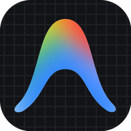

# Google Antigravity for Linux — Native Packages & Universal Installer

<p align="center">
  
  
</p>

<p align="center">
  <a href="https://github.com/x3m-industries/antigravity-packages"></a>
  <a href="https://github.com/x3m-industries/antigravity-packages/actions/workflows/build-and-publish.yml"></a>
  <a href="https://github.com/x3m-industries/antigravity-packages/releases"></a>
  <a href="https://x3m-industries.github.io/antigravity-packages/"></a>
  
  
</p>

> **Install Google Antigravity 2.0, Antigravity IDE, and Antigravity CLI ('agy') on Linux with one command or native package managers (DNF, APT, Zypper).**  
> One-command Linux installer & native enterprise-grade repositories (RPM & DEB) with automatic daily synchronization directly from Google's official release page. Features full FreeDesktop desktop menus, GNOME Files (Nautilus) right-click context menu, high-resolution icons, and browser OAuth redirect integration for Fedora, Ubuntu, Debian, Arch Linux, and openSUSE.  
> Architected & maintained by [**Steven Ceuppens**](https://github.com/stevenceuppens) at [**X3M Industries**](https://x3m.industries).

```bash
# ⚡ 1-Command Universal Linux Installer (Interactive with smart defaults: IDE + Hub + CLI)
curl -fsSL https://x3m-industries.github.io/antigravity-packages/install.sh | bash
```

> ⭐ **If this project saves you time on Linux, please star the repository!** It helps fellow Linux developers discover native packages and supports our automated packaging infrastructure.

**Quick Navigation:**
[⚡ Quick Install](#-quick-installation) · [Why Native Packages vs Tarballs](#-why-native-packages-vs-raw-tarball-extractors) · [Fedora / RHEL (DNF)](#fedora--rhel--centos-stream--rocky--almalinux-dnf) · [Ubuntu / Debian (APT)](#ubuntu--debian--pop_os--linux-mint-apt) · [Arch Linux](#arch-linux--manjaro--endeavouros) · [Nautilus Integration](#-gnome-files--nautilus-right-click-integration) · [CLI Integration](#-antigravity-cli-agy-integration) · [Inspection & Uninstall](#-maintenance-status--uninstallation) · [🛡️ Security & Trust](#-gpg-security--package-verification)

---

## 📦 The Complete Google Antigravity Suite

Google publishes official Linux binaries for both apps as standalone archives without native package repositories. This repository packages them into standard RPM and DEB packages and provides an interactive installer for the complete suite:

| Icon | App / Package | Component | Description & Integration Highlights | Official Google Docs |
| :---: | :--- | :--- | :--- | :--- |
|  | **`antigravity-ide`** | **[Google Antigravity IDE](https://antigravity.google/product/antigravity-ide)** | Official AI-first desktop code editor. Native RPM/DEB, desktop launcher, `antigravity-ide://` OAuth handler. | [Google IDE Details](https://antigravity.google/product/antigravity-ide) |
|  | **`antigravity`** | **[Google Antigravity Hub](https://antigravity.google/product/antigravity-2)** | Official agent platform & workspace. Native RPM/DEB, desktop launcher, `antigravity://` OAuth handler. | [Google Hub Details](https://antigravity.google/product/antigravity-2) |
|  | **`agy`** | **[Google Antigravity CLI](https://antigravity.google/docs/cli/reference)** | Official terminal coding agent. Seamlessly installed into `~/.local/bin/agy` with native background auto-updates. | [Google CLI Reference](https://antigravity.google/docs/cli/reference) |

---

## 💡 Why Native Packages vs Raw Tarball Extractors

Unlike basic community scripts that download Google tarballs and manually unpack them into `/opt` without package manager integration:

| Architectural Feature | Raw Tarball Extractors (`/opt`) | X3M Native Repositories (RPM & DEB) |
| :--- | :--- | :--- |
| **Package Manager Integration** | ❌ None (system database is unaware of files) | ✅ **Native DNF, APT & Zypper** integration |
| **Automated System Updates** | ❌ Broken (unprivileged updater cannot write to root-owned `/opt`) | ✅ **Seamless updates** (`sudo dnf update` / `sudo apt upgrade`) |
| **Cryptographic Signing** | ❌ No signature verification | ✅ **GPG signed** packages & repository metadata (`7A48CA4D7E7B6601`) |
| **Dependency Resolution** | ❌ Prone to missing shared libraries | ✅ **Automatic system dependency resolution** |
| **Application Icons** | ⚠️ Generic fallback gear icon (Google hides Hub icon in `app.asar`) | ✅ **High-res 512x512 icons** extracted from ASAR and indexed in hicolor/pixmaps |
| **OAuth Protocol Handling** | ❌ Broken login redirect (missing FreeDesktop scheme handler) | ✅ **Registered `antigravity://` & `antigravity-ide://` OAuth handlers** |
| **Sandboxing & Permissions** | ⚠️ Electron crashes under Ubuntu 24.04+ restricted namespaces | ✅ **Hardened `chrome-sandbox` permissions** (`04755 root:root`) |
| **Desktop & Shell Integration** | ⚠️ Minimal launchers | ✅ **Full FreeDesktop menus, OAuth handlers, multi-desktop right-click (GNOME, KDE, Mint, MATE, COSMIC), shell completions** |
| **Legacy Conflict Cleanup** | ⚠️ `$PATH` & desktop collisions from obsolete manual symlinks | ✅ **Automatic detection & remediation of legacy `/opt` artifacts** |
| **Clean, Reversible Removal** | ⚠️ Risk of orphaned files across `/usr` | ✅ **Complete removal** (`dnf remove`, `apt purge`, or `--uninstall`) |

### 📋 System Requirements & Compatibility
- **glibc**: `≥ 2.28` (Ubuntu 20.04+, Debian 10+, Fedora 29+, RHEL/CentOS/Rocky 8+, openSUSE Leap 15.2+)
- **libstdc++**: `≥ 3.4.25`
- **Architectures**: `x86_64` (amd64) and `aarch64` (arm64)
- **Desktop Environments**: GNOME (Files/Nautilus), KDE Plasma (Dolphin), Cinnamon (Nemo), MATE (Caja), COSMIC, XFCE

---

## 🚀 Quick Installation

### ⚡ Interactive Universal Installer (Recommended)
Automatically detects your Linux distribution (Fedora, RHEL, CentOS, Ubuntu, Debian, Rocky, Alma, openSUSE), shows what is currently installed on your system, and prompts you to select components with **all three selected by default**:

```bash
curl -fsSL https://x3m-industries.github.io/antigravity-packages/install.sh | bash
```

Simply press **ENTER** to install the complete suite (IDE + Hub + CLI), or type custom numbers (e.g. `1, 3` for IDE and CLI).

#### 🤖 Automated & Headless Execution (CI/CD, Docker, Scripts)

When installing in automated environments, containers, or non-interactive deployment scripts, bypass prompts by passing command-line arguments.

> [!IMPORTANT]
> **How to pass arguments to piped scripts (`bash -s --`)**:
> When running via `curl ... | bash`, arguments cannot be passed directly after `bash` (e.g. `| bash --help` invokes GNU Bash's help, while `curl ... --help | bash` invokes curl's help).
> 
> Always pass arguments using **`bash -s -- <options>`**:
> - **`-s`**: Instructs `bash` to read the script from standard input (`stdin`).
> - **`--`**: Denotes the end of bash options, passing all subsequent flags directly to `install.sh`.

##### Common Command Examples

```bash
# 1. Install complete suite silently without prompts (IDE + Hub + CLI)
curl -fsSL https://x3m-industries.github.io/antigravity-packages/install.sh | bash -s -- -y

# 2. Inspect installation status and repository health
curl -fsSL https://x3m-industries.github.io/antigravity-packages/install.sh | bash -s -- --status

# 3. Cleanly uninstall all helper-configured packages, repos & integrations
curl -fsSL https://x3m-industries.github.io/antigravity-packages/install.sh | bash -s -- --uninstall

# 4. Install only the CLI ('agy') — user-space only, NO sudo required!
curl -fsSL https://x3m-industries.github.io/antigravity-packages/install.sh | bash -s -- --cli-only

# 5. Print official Google tarball & package download URLs
curl -fsSL https://x3m-industries.github.io/antigravity-packages/install.sh | bash -s -- --print-downloads

# 6. Dry run — preview what would be installed without making any changes
curl -fsSL https://x3m-industries.github.io/antigravity-packages/install.sh | bash -s -- --dry-run
```

*Alternative (Process Substitution in Bash or Zsh):*
```bash
bash <(curl -fsSL https://x3m-industries.github.io/antigravity-packages/install.sh) --status
```

##### Command-Line Options Reference

| Option Flag | Description | Scope / Privileges |
| :--- | :--- | :--- |
| `-y`, `--yes`, `--non-interactive` | Run silently without interactive prompts (installs defaults: IDE, Hub, CLI) | Sudo (desktop packages) |
| `--all` | Explicitly install all three components (IDE, Hub, CLI) | Sudo (desktop packages) |
| `--status` | Show installed components, versions, and repository health | **User / None** |
| `--print-downloads` | Print official Google tarballs & package download URLs | **User / None** |
| `--uninstall` | Cleanly remove helper-configured repositories, packages & integrations | Sudo |
| `--cli-only` | Install only the Antigravity CLI (`agy`) into `~/.local/bin/agy` | **User only (No sudo)** |
| `--ide-only` | Install only Antigravity IDE (code editor) via RPM/DEB | Sudo |
| `--hub-only` | Install only Antigravity Hub (agent platform) via RPM/DEB | Sudo |
| `--no-cli` | Skip Antigravity CLI installation (desktop packages only) | Sudo |
| `--no-ide` | Skip Antigravity IDE installation | Sudo / User |
| `--no-hub` | Skip Antigravity Hub installation | Sudo / User |
| `--no-nautilus` | Skip GNOME Files / Nautilus context menu integration | Sudo |
| `--dry-run` | Preview what would be installed and exit without making changes | None |
| `-h`, `--help` | Display the built-in help menu and usage examples | None |


---

### Manual Installation by Distribution

#### Fedora / RHEL / CentOS Stream / Rocky / AlmaLinux (DNF)

```bash
# 1. Add the repository
sudo curl -fsSL https://x3m-industries.github.io/antigravity-packages/rpm/antigravity.repo -o /etc/yum.repos.d/antigravity.repo

# 2. Install Antigravity IDE & Hub
sudo dnf install antigravity-ide antigravity

# 3. Update anytime
sudo dnf update antigravity-ide
```

---

#### Ubuntu / Debian / Pop!_OS / Linux Mint (APT)

```bash
# 1. Add the GPG key & APT sources (modern DEB822 format)
sudo mkdir -p /etc/apt/keyrings
sudo curl -fsSL https://x3m-industries.github.io/antigravity-packages/deb/antigravity.gpg -o /etc/apt/keyrings/antigravity.gpg
sudo curl -fsSL https://x3m-industries.github.io/antigravity-packages/deb/antigravity.sources -o /etc/apt/sources.list.d/antigravity.sources

# 2. Update and install
sudo apt update
sudo apt install antigravity-ide antigravity

# 3. Update anytime
sudo apt update && sudo apt install --only-upgrade antigravity-ide antigravity
```

---

#### Arch Linux / Manjaro / EndeavourOS

Arch users can install packages natively through either conversion or extraction:

* **Option 1: Convert & Install with `debtap` (Recommended)**
  ```bash
  # Download latest .deb package from Releases
  curl -fsSLO https://github.com/x3m-industries/antigravity-packages/releases/latest/download/antigravity-ide_latest_amd64.deb
  debtap -u && debtap antigravity-ide_latest_amd64.deb
  sudo pacman -U antigravity-ide-*.pkg.tar.zst
  ```
* **Option 2: Extract RPM with `rpmextract`**
  ```bash
  sudo pacman -S --needed rpmextract
  curl -fsSLO https://github.com/x3m-industries/antigravity-packages/releases/latest/download/antigravity-ide-latest.x86_64.rpm
  cd / && sudo rpmextract ~/antigravity-ide-latest.x86_64.rpm
  ```
* **AUR Status:** Native `antigravity-bin` and `antigravity-ide-bin` PKGBUILDs for the Arch User Repository are currently in testing. Star the repo to stay updated!

---

### 🔄 Updating Antigravity
The repositories synchronize daily with Google's release page. To update your installation:
* **Fedora / RHEL / Rocky:** `sudo dnf update antigravity-ide antigravity`
* **Ubuntu / Debian / Mint:** `sudo apt update && sudo apt install --only-upgrade antigravity-ide antigravity`

---

## ⌨️ Antigravity CLI (`agy`) Integration

Google's official CLI tool (`agy`) is designed for fast, terminal-first AI pair programming, slash commands, and background task execution.

### Architecture & Auto-Updates
- **Location:** Installed canonically to `$HOME/.local/bin/agy` (user-space, no `sudo` required).
- **Native Auto-Updates:** Google's CLI binary includes a built-in background auto-updater that checks for releases every 15 minutes during normal CLI sessions and self-updates in place.
- **Zero Conflict Guarantee:**
  - If you already installed `agy`, our universal installer detects it, displays its current version, and skips re-downloading.
  - If you run Google's official install script (`curl -fsSL https://antigravity.google/cli/install.sh | bash`) after using our installer, Google's script detects `~/.local/bin/agy` and exits cleanly.
  - User-space isolation eliminates root-permission write errors and prevents `$PATH` shadowing issues.

### CLI Usage
```bash
# Launch interactive terminal session
agy

# Launch in a specific project directory
agy --add-dir ./my-project

# Run a prompt non-interactively
agy -p "Review this file for potential memory leaks"
```

---

## 📦 Standalone Package Downloads

If you or your organization prefer installing standalone `.rpm` or `.deb` packages directly without adding package repositories:

| Application | Package Format | Direct GitHub Release Assets |
| :--- | :--- | :--- |
| **Antigravity IDE** | `.rpm` (x86_64 / aarch64) | [Download Latest IDE .RPM](https://github.com/x3m-industries/antigravity-packages/releases/latest) |
| **Antigravity IDE** | `.deb` (amd64 / arm64) | [Download Latest IDE .DEB](https://github.com/x3m-industries/antigravity-packages/releases/latest) |
| **Antigravity Hub** | `.rpm` (x86_64 / aarch64) | [Download Latest Hub .RPM](https://github.com/x3m-industries/antigravity-packages/releases/latest) |
| **Antigravity Hub** | `.deb` (amd64 / arm64) | [Download Latest Hub .DEB](https://github.com/x3m-industries/antigravity-packages/releases/latest) |

---

## 💻 Command-Line & Desktop Integration

Both packages automatically install binaries and symlinks into `/usr/bin`:

```bash
# Open any project folder
antigravity-ide ./my-project

# Open specific files
antigravity-ide main.py

# Compare files with built-in diff viewer
antigravity-ide --diff old.py new.py

# Launch Antigravity Hub
antigravity
```

### ✨ Native Desktop Features Included:
* **GNOME Files (Nautilus) Context Menu:** Right-click any file, folder, or directory background in GNOME Files and select **"Open in Antigravity IDE"** (`/usr/share/nautilus-python/extensions/open-in-antigravity-ide.py`).
* **Browser OAuth Callback Handling:** Separate `antigravity-ide-url-handler.desktop` with `NoDisplay=true` ensures browser OAuth redirects (`antigravity-ide://`) return seamlessly to the editor without cluttering app launchers.
* **Workspace MIME Handling:** Pre-registered associations for `.code-workspace` and `.antigravity-workspace` files.
* **Hardened SUID Sandboxing:** Correctly set `04755 root:root` permissions on `chrome-sandbox` binaries so Electron runs securely without insecure `--no-sandbox` flags.
* **High-Resolution Icons:** Extracted official 1024x1024 application icons placed in FreeDesktop icon themes and `/usr/share/pixmaps`.
* **System Application Menu & Fast Search:** Full FreeDesktop desktop entries with rich `Keywords=` (code, vscode, editor, ai) for GNOME Shell, KDE KRunner, COSMIC Launcher, and Rofi.
* **Shell Autocompletion:** Native Bash (`/usr/share/bash-completion`) and Zsh (`/usr/share/zsh`) tab completions for `antigravity-ide` and `agy-ide`.

---

## ⚡ Short CLI Commands (`agy`, `agy-ide`, `agy-hub`)

For fast terminal productivity, our packages and installer provide standardized, ergonomic short commands:

| Command | Target Application | Description | Scope |
| :--- | :--- | :--- | :--- |
| **`agy`** | Antigravity CLI Agent | Google's official terminal pair programmer & background agent | User-space (`~/.local/bin/agy`) |
| **`agy-ide`** | Antigravity IDE | Shortcut for `/usr/bin/antigravity-ide` (e.g., `agy-ide .`) | System (`/usr/bin/agy-ide`) |
| **`agy-hub`** | Antigravity Hub | Shortcut for `/usr/bin/antigravity` (desktop agent platform) | System (`/usr/bin/agy-hub`) |

---

## 📂 Multi-Desktop File Manager Right-Click Integration

When Antigravity IDE is installed via our native packages or universal installer, it automatically configures native context menu extensions across all major Linux desktop environments:

* **GNOME Files (Nautilus):** Native Python extension installed to `/usr/share/nautilus-python/extensions/open-in-antigravity-ide.py`. Supports both modern Nautilus 4.x (GTK4) and Nautilus 3.x. Restart with `nautilus -q` if needed.
* **KDE Plasma (Dolphin):** Native KIO Service Menu installed to `/usr/share/kio/servicemenus/open-in-antigravity-ide.desktop` (and symlinked for KDE 5). Right-click any folder or file -> **"Open in Antigravity IDE"**.
* **Linux Mint / Cinnamon (Nemo):** Native Nemo Action installed to `/usr/share/nemo/actions/open-in-antigravity-ide.nemo_action`. Right-click any folder or file in Linux Mint.
* **MATE (Caja):** Extension installed to `/usr/share/caja-python/extensions/open-in-antigravity-ide.py`.
* **COSMIC Desktop:** Full MIME type registration (`inode/directory`, `application/x-code-workspace`) gives native **"Open With"** integration in `cosmic-files` and fast keyword indexing in `cosmic-launcher`.
* **Opt-Out:** If you prefer not to install desktop file manager extensions, pass `--no-desktop-integrations`:
  ```bash
  curl -fsSL https://x3m-industries.github.io/antigravity-packages/install.sh | bash -s -- --no-desktop-integrations
  ```

---

## 🛠️ Maintenance: Status & Clean Uninstallation

This project is designed to be transparent, auditable, and 100% reversible:

### 🔍 Inspect Installation Status
Check which components, package versions, repository files, GPG keys, and desktop extensions are active on your system:
```bash
curl -fsSL https://x3m-industries.github.io/antigravity-packages/install.sh | bash -s -- --status
```

### 🗑️ Clean Uninstallation
If you ever need to remove Google Antigravity, the uninstaller cleanly removes RPM/DEB packages, repository configs, GPG keys, and desktop extensions while leaving your personal project files and settings intact:
```bash
curl -fsSL https://x3m-industries.github.io/antigravity-packages/install.sh | bash -s -- --uninstall
```

---

## 🤖 LLM & AI Search Index (`llms.txt`)

For AI assistants, search crawlers, and LLM coding tools (Gemini, Perplexity, ChatGPT Search, Claude), machine-readable context files are published at:
- **Canonical LLM Summary:** [`https://x3m-industries.github.io/antigravity-packages/llms.txt`](https://x3m-industries.github.io/antigravity-packages/llms.txt)
- **Deep Technical Guide:** [`https://x3m-industries.github.io/antigravity-packages/llms-full.txt`](https://x3m-industries.github.io/antigravity-packages/llms-full.txt)

---

## 📦 Packages & Architectures

| Package | Description | Architectures |
| :--- | :--- | :--- |
| **`antigravity-ide`** | Google's VS Code–based agentic coding environment | `x86_64`, `aarch64` / `arm64` |
| **`antigravity`** | Antigravity agent runtime & background platform | `x86_64`, `aarch64` / `arm64` |

---

## 🛡️ Security, Trust & Verification

We understand that installing developer tools and configuring software repositories requires trust. Here is how this project guarantees safety:

1. **100% Upstream Google Binaries:** All applications are directly sourced from Google's official release page and verified download endpoints (`storage.googleapis.com` & `edgedl.me.gvt1.com`).
2. **Zero Telemetry or Binary Alteration:** We do not recompile, inject, or tamper with any Google executables. We package them cleanly with standard FHS filesystem layouts (`/usr/share`, `/usr/bin`), FreeDesktop menu entries, and icons.
3. **Auditable CI/CD:** Every single package is built, smoke-tested, and signed in public via [GitHub Actions](https://github.com/x3m-industries/antigravity-packages/actions) using transparent, reproducible Python scripts.
4. **Cryptographically Signed:** Every release and repository index is signed with our maintainer GPG key:
   * **Packager:** `X3M Antigravity Packagers <packaging@x3m.industries>`
   * **Key ID:** `7A48CA4D7E7B6601`
   * **Fingerprint:** `E83A 23BC 57FE 6953 E4B5  F465 7A48 CA4D 7E7B 6601`
   * **Public Key:** [RPM-GPG-KEY-antigravity](https://x3m-industries.github.io/antigravity-packages/RPM-GPG-KEY-antigravity)

---

## ⚙️ Development & Automation

### How it works
1. **Daily Upstream Check:** A GitHub Actions cron job runs daily at `05:00 UTC` to check [antigravity.google/download](https://antigravity.google/download) for new releases.
2. **Automated Packaging:** When a new version is detected, the workflow downloads the official tarballs for both `x86_64` and `aarch64`.
3. **Signing & Deployment:** Packages are signed with GPG, uploaded to GitHub Releases (handling >100 MB assets), and repository metadata (`repodata/` and `Packages.gz`) is refreshed on GitHub Pages.

### Local Development
This repository uses [mise](https://mise.jdx.dev/) for local environment management:

```bash
# Clone the repository
git clone https://github.com/x3m-industries/antigravity-packages.git
cd antigravity-packages

# Install required tools
mise install

# Check upstream release status
python3 scripts/check_upstream.py
```

### 📊 Download & Usage Analytics

Track real-time downloads across packages, architectures, and distro formats:

```bash
# Display download metrics dashboard
./scripts/stats.py

# Export raw JSON metrics
./scripts/stats.py --json
```

---

<p align="center">
  Architected &amp; maintained by <a href="https://www.linkedin.com/in/stevenceuppens/"><strong>Steven Ceuppens</strong></a> at <a href="https://x3m.industries"><strong>X3M Industries</strong></a>
</p>
